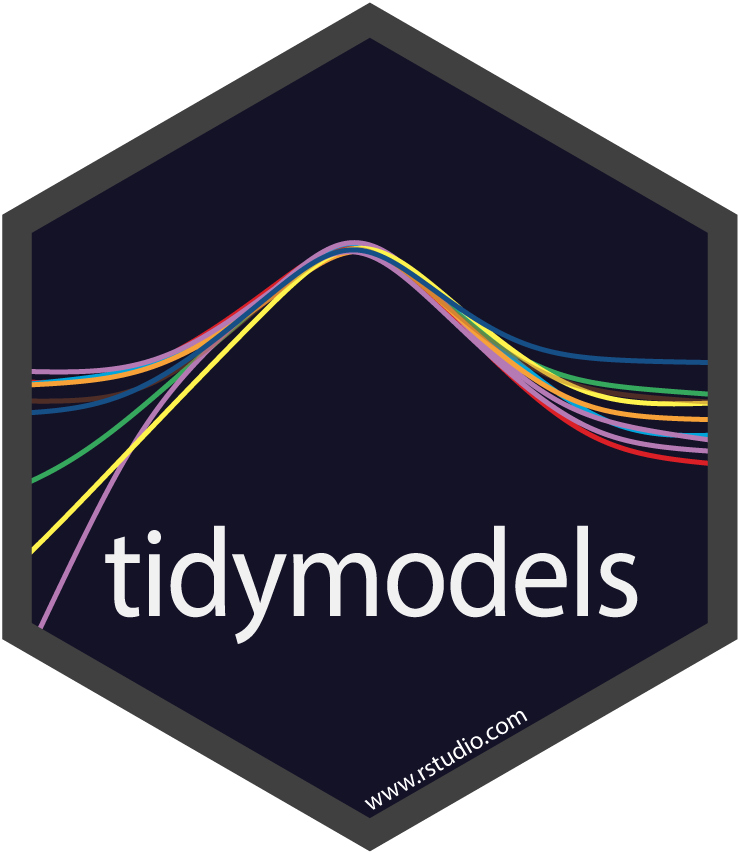

class: left, middle
## Antes de empezar `r emo::ji("person_in_lotus_position_light_skin_tone")`

#### > Este taller es un punto de partida para el uso de modelos mixtos con R y {tidymodels}

#### > No se utilizan fórmulas matemáticas, como un intento de hacerlo amigable e intuitivo

#### > Si surgen dudas, no te preocupes, es normal; además que también podemos ir algo rápido

#### > El código y la presentación quedarán disponibles

#### > Habrá espacio para preguntas


---
class: center, middle
## ¿Qué es el modelamiento con efectos mixtos y por qué es importante?


---
class: center, middle
## `> Datos de las diferentes áreas del conocimiento pueden presentar heterogeneidad`


---
class: center, middle
## `> Como consecuencia de estar agrupados, ser provenientes de estudios longitudinales o presentar algún otro tipo de medidas repetidas`


---
class: center, middle
##`> Por ejemplo, datos de los capítulos de R-Ladies por continente`

.center[]

---
class: center, middle
##`> Datos de las integrantes de  R-Ladies por capítulos`

.center[]

---
class: center, middle
## `> El tipo de medidas repetidas induce una estructura de correlación, que si no es considerada puede llevar a estimaciones sesgadas`

---
class: center, middle
## `>  Afectando inferencias y predicciones y, por tanto, la toma de decisiones basadas en datos (data-driven decision-making)`


---
class: left

.pull-left[
## Modelos lineales

`>` Errores aleatorios independientes con varianza constante

`>` Errores aleatorios siguen una distribución normal


]

.pull-right[
## Modelos lineales mixtos

 `>` Incorpora efectos aleatorios para acomodar la correlación entre las observaciones 

 `>` Condicionado a los efectos aleatorios, los errores aleatorios son independientes con  varianza constante 
 
 `>` Errores aleatorios con distribución normal

 `>` Efectos aleatorios con distribución normal 

 `>` Efectos aleatorios y errores aleatorios son independientes 
]

---
class: left

## Tidymodels  


### `>` .left[]

### `> {broom.mixed}` 

https://cran.r-project.org/web/packages/broom.mixed/index.html

---
class: left
## Modelos mixtos `r emo::ji("package")`

### `> {lme4}` 

https://cran.r-project.org/web/packages/lme4/index.html

### `> {lmerTest}`

https://cran.r-project.org/web/packages/lmerTest/index.html


---
class: center, middle
## Datos de dragones `r emo::ji("dragon")`

### .left[`> Datos ficticios de Gabriela Hajduk`]


---
class: center, middle
## Datos de dragones `r emo::ji("dragon")`

### .left[`> Decidimos entrenar dragones y, por tanto, salimos a diferentes sitios de las montañas y recopilamos datos sobre la inteligencia de los dragones`]


---
class: center, middle
## Datos de dragones `r emo::ji("dragon")`

### .left[`> Inteligencia (testScore), longitud corporal (bodyLength), sitios (site) y cadenas montañosas (mountainRange)`] 

---
class: left, middle
## Cargar paquetes, leer y mirar los datos

```{r message=FALSE}
library(tidyverse)
library(readr)
library(dplyr)
```

```{r message=FALSE}
dragones <- read_tsv("dragons.tsv") 
glimpse(dragones)
```

---
class: center, middle
## Limpieza y transformación de datos  `r emo::ji("white_check_mark")`

---
class: left, middle
## Resumen preliminar de los datos 

```{r message=FALSE}
library(skimr)
skim(dragones) %>% tibble::as_tibble()
```

---
class: center, middle

## `Supongamos que queremos saber cómo afecta la longitud del cuerpo (bodyLength) de los dragones a sus puntuaciones en las pruebas (testScore)`

---
class: left, middle
## Análisis exploratorio de datos `r emo::ji("detective")`

.pull-left[
```{r plot-last1, fig.show = 'hide'}
dragones %>% ggplot(aes(x=bodyLength, 
             y=testScore)) + 
             geom_jitter(alpha=.2)+
             theme_bw()
```
]

.pull-right[
```{r ref.label = 'plot-last1', echo = FALSE}

```
]

---
class: left, middle
## `Si hay más covariables`  `r emo::ji("eyes")`

`>` Se deben estandarizar 

`>` Garantiza que las estimaciones estén en la misma escala, facilitando la comparación de los tamaños de los efectos 

`>` Se puede usar la función scale() de {base}:

.center[
```{r}
dragones$bodyLength2 <- scale(dragones$bodyLength)
```
]

---
class: center, middle

## `Retomando: ¿la puntuación de la prueba (testScore) se ve afectada por la longitud del cuerpo (bodyLength)?`


---
class: center, middle

## `A partir del análisis exploratorio de datos se propone un modelo lineal`

---
class: Left, middle

## Usaremos {stats} `r emo::ji("package")`

`>` lm(): Ajusta modelos lineales

`>` ¡existen muchas funciones más!


---
class: Left, middle

## Usaremos {broom} 

`>` tidy(): Construye un tibble que resume los hallazgos estadísticos del modelo

`>` augment(): Agrega columnas a los datos originales que se modelaron

`>` glance(): Construye un resumen de otras informaciones relacionadas al modelo


---
class: left, middle

## Cargar paquetes 
.left[
```{r message=FALSE, warning=FALSE}
library(tidymodels)
library(broom)
```
]


---
class: left, middle
.left[
## Ajustar un modelo lineal 
```{r message=FALSE}
ajuste_lm <- lm(testScore ~ bodyLength, data=dragones)
```
]

---
class: left, middle
## Obtener información sobre el modelo 
.left[
```{r message=FALSE}
tidy(ajuste_lm) %>% tibble::as_tibble()
```

```{r message=FALSE}
glance(ajuste_lm) %>% tibble::as_tibble()
```
]

---
class: left, middle
## Graficar el ajuste del modelo

.pull-left[
```{r plot-last2, fig.show = 'hide'}
info_ajuste_lm<-
  augment_columns(ajuste_lm, dragones) 

info_ajuste_lm %>% 
ggplot(aes(x=bodyLength,y=testScore))+ 
geom_jitter(alpha=.2)+
geom_line(aes(x=bodyLength,y=.fitted))+
theme_bw()
```
]

.pull-right[
```{r ref.label = 'plot-last2', echo = FALSE}

```
]


---
class: left, middle
## Verificar los supuestos `r emo::ji("exclamation_mark")`

### Linealidad

.pull-left[
```{r plot-last4, fig.show = 'hide'}
plot(ajuste_lm, which=1)
```
]
.pull-right[
```{r ref.label = 'plot-last4', echo = FALSE}

```
]

---
class: left, middle
## Verificar los supuestos `r emo::ji("exclamation_mark")`

### Normalidad 

.pull-left[
```{r plot-last3, fig.show = 'hide'}
plot(ajuste_lm, which=2)
```
]
.pull-right[
```{r ref.label = 'plot-last3', echo = FALSE}

```
]

---
class: left, middle
## Verificar los supuestos `r emo::ji("exclamation_mark")`

### Homocedasticidad

.pull-left[
```{r plot-last5, fig.show = 'hide'}
plot(ajuste_lm, which=3)
```
]
.pull-right[
```{r ref.label = 'plot-last5', echo = FALSE}

```
]


---
class: center, middle 
##  `¿Qué hacemos si el modelo no es adecuado?`


---
class: center, middle 
## `¡Dejémos que los datos hablen!` `r emo::ji("speaking_head")`


---
class: left, middle
## Análisis exploratorio de datos `r emo::ji("detective")` `r emo::ji("dragon")`
.pull-left[
```{r plot-last6, fig.show = 'hide'}
dragones %>% 
 ggplot(aes(x=bodyLength,y=testScore)) +
 geom_jitter(alpha=2) +
 theme_bw()
```
]
.pull-right[
```{r ref.label = 'plot-last6', echo = FALSE}

```
]

---
class: left, middle 
## Análisis exploratorio de datos `r emo::ji("detective")` `r emo::ji("dragon")` `r emo::ji("mountain")`

.pull-left[
```{r plot-last7, fig.show = 'hide'}
dragones %>%
  ggplot(aes(x=bodyLength,y=testScore, 
        colour=mountainRange)) +
  geom_jitter(alpha=2) +
  theme_bw()
```
]
.pull-right[
```{r ref.label = 'plot-last7', echo = FALSE}

```
]

---
class: left, middle 
## Análisis exploratorio de datos `r emo::ji("detective")` `r emo::ji("dragon")` `r emo::ji("mountain")`

.pull-left[
```{r plot-last8, fig.show = 'hide'}
dragones %>% 
  ggplot(aes(bodyLength,testScore,
      colour = mountainRange))+
  geom_jitter(alpha=2) + 
  facet_wrap(~ mountainRange) +
  theme_bw()+
  theme(strip.background 
  =element_rect(fill="white"))
```
]
.pull-right[
```{r ref.label = 'plot-last8', echo = FALSE}

```
]

---
class: left, middle 
## Análisis exploratorio de datos `r emo::ji("detective")` `r emo::ji("dragon")` `r emo::ji("mountain")`

.pull-left[
```{r plot-last9, fig.show = 'hide'}
dragones %>% 
 ggplot(aes(x=mountainRange,
  y=testScore, 
  colour=mountainRange))+ 
  geom_boxplot(alpha=.5)+
  coord_flip()+
  theme_bw()
```
]
.pull-right[
```{r ref.label = 'plot-last9', echo = FALSE}

```
]

---
class: center, middle 
## `¡No podemos ignorar las cadenas montañosas!` `r emo::ji("mountain")` 

---
class: center, middle 
## `¿Cómo las incorporamos al modelo?` `r emo::ji("mountain")` 
 

---
class: center, middle

## `¡Con los modelos lineales mixtos!`


---
class: center, middle

##`A partir del análisis exploratorio de datos se propone un modelo lineal mixto`

---
class: Left, middle

## `Usaremos {lme4}` `r emo::ji("package")`

`>` lmer(): Ajusta un modelo lineal mixto

`>` ¡existen muchas funciones más!


---
class: Left, middle

## `Usaremos {broom.mixed}` 

`>` tidy(): Construye un tibble que resume los hallazgos estadísticos del modelo

`>` augment(): Agrega columnas a los datos originales que se modelaron

`>` glance(): Construye un resumen de otras informaciones relacionadas al modelo


---
class: left, middle

## Cargar paquetes 
.left[
```{r message=FALSE, warning=FALSE}
library(tidymodels)
library(broom.mixed)
library(lme4)
```
]

---
class: left, middle
## Ajustar un modelo lineal mixto 

.left[
### `Incorporaremos las cadenas montañosas con la expresión (1|mountainRange)` 

```{r message=FALSE}
ajuste_lmer <- lmer(testScore ~ bodyLength + (1|mountainRange), data = dragones)
```

]

---
class: left, middle
## Obtener información sobre el modelo

.left[
```{r message=FALSE}
tidy(ajuste_lmer) %>% tibble::as_tibble()
```

```{r message=FALSE}
glance(ajuste_lmer) %>% tibble::as_tibble()
```
]

---
class: center, middle

## `¿No hay p-valor?`


                    
---
class: left, middle

## Adicionando p-valor `r emo::ji("raised_fist_light_skin_tone")`

.left[

```{r message=FALSE}
library(lmerTest)
ajuste_lmer <- lmer(testScore ~ bodyLength + (1|mountainRange), data = dragones)
```

```{r message=FALSE}
tidy(ajuste_lmer) %>% tibble::as_tibble()
```
]            

---
class: left, middle
## Graficar el ajuste del modelo

.pull-left[
```{r plot-last10, fig.show = 'hide'}
info_ajuste_lmer<- 
augment_columns(ajuste_lmer,dragones)

info_ajuste_lmer %>% 
 ggplot(aes(x=bodyLength,y=testScore,
   colour=mountainRange))+ 
 geom_jitter(alpha=2)+ 
 facet_wrap(~ mountainRange)+
 geom_line(aes(x=bodyLength,y=.fitted),
 colour="black")+
theme_bw()
```
]

.pull-right[
```{r ref.label = 'plot-last10', echo = FALSE}

```
]


---
class: left, middle
## Verificar los supuestos

### Linealidad y homocedasticidad

.pull-left[
```{r plot-last13, fig.show = 'hide'}
y.fit <- fitted(ajuste_lmer)
res.fit <- residuals(ajuste_lmer)
plot(y.fit, res.fit) 
abline(h=0, lty=2,col="red")
```
]
.pull-right[
```{r ref.label = 'plot-last13', echo = FALSE}

```
]

---
class: left, middle
## Verificar los supuestos

### Normalidad del error

.pull-left[
```{r plot-last11, fig.show = 'hide'}
y.fit <- fitted(ajuste_lmer)
res.fit <- residuals(ajuste_lmer)
qqnorm(res.fit) 
qqline(res.fit)
```
]

.pull-right[
```{r ref.label = 'plot-last11', echo = FALSE}

```
]


---
class: left, middle
## Verificar los supuestos

### Normalidad del efecto aleatorio

.pull-left[
```{r plot-last12, fig.show = 'hide'}
pred.fit<-ranef(ajuste_lmer)[[1]][[1]]
qqnorm(pred.fit) 
qqline(pred.fit)
```
]
.pull-right[
```{r ref.label = 'plot-last12', echo = FALSE}

```
]


---
class: center, middle

##`¿Y si ahora incorporamos los sitios?` `r emo::ji("eyes")`

.left[
`Podemos incorporar los sitios con la expresión (1|mountainRange/site) o (1|mountainRange) + (1|mountainRange:site)`
]


---
class: left

##`Referencias` `r emo::ji("book")`

### > Gabriela Hajduk  

https://gkhajduk.github.io/2017-03-09-mixed-models/

### > Athanasia Mowinckel

https://athanasiamo.github.io/LME_introduction_workshop/

### > Ben Bolker

https://github.com/bbolker

### > Douglas Bates 
https://github.com/dmbates

---
class: left

##`Referencias``r emo::ji("book")`

### > Max Kuhn, Hadley Wickham and RStudio

https://www.tidymodels.org/

### > Max Kuhn and Julia Silge 

https://www.tmwr.org/

### > David Robinson y +

https://github.com/tidymodels/broom

### > Ben Bolker y + 

https://github.com/bbolker/broom.mixed


---
class: center, middle

##`¡Comienza a usar modelos mixtos y {tidymodels} con tus propios datos!``r emo::ji("woman_technologist_light_skin_tone")`


---
class: center, middle


.center[]


##### Presentación creada con el paquete [**xaringan**](https://github.com/yihui/xaringan) de [**Yihui Xie**](https://github.com/yihui) y el tema [**rladies**](https://github.com/rbind/apreshill/blob/master/static/slides/rladies-demo-slides.Rmd) de [**Alison Hill**](https://github.com/apreshill) 


`@aleants @RLadiesTalca` 
